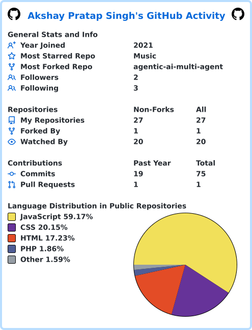

### Software Developer (ML/AI) @ S&P Global
**AI Engineer specializing in multi-LLM orchestration, RAG, and agentic systems**

 

## About Me

- 🔭 Building **production RAG systems** and **agentic AI workflows** at **S&P Global**
- 🧠 Working on document-intelligence pipelines — **AWS Textract + Gemini Flash** for entity extraction
- 📊 Also ship classical ML — **XGBoost + SHAP** for explainable, production-grade models
- 🌱 Currently deepening **LangChain**, **LangGraph**, and **MCP (Model Context Protocol)** server development
- 🎓 B.Tech CSE, Lovely Professional University (2025)
- 💼 Past: ML-driven hiring & churn modeling at **GAP Inc.**
- ⚡ I like turning "it kind of works" LLM demos into systems that don't fall over in production

 

## Tech Stack

<table>
<tr><td valign="top" width="130"><b>Languages</b></td><td>

</td></tr>
<tr><td valign="top"><b>GenAI / LLM</b></td><td>

</td></tr>
<tr><td valign="top"><b>ML / Data</b></td><td>

</td></tr>
<tr><td valign="top"><b>Cloud & Tools</b></td><td>

</td></tr>
</table>

 

## Featured Projects

**[product-research-agent](https://github.com/rakshay01/product-research-agent)** — Python
> Add a one-line impact statement here (what it does, what it's built with, why it matters).

> *Pin 2–3 more of your strongest repos below — GitHub → your profile → "Customize your pins." Aim for one RAG/agentic project and one classical ML project alongside this one.*

 

## GitHub Stats

*(This image is generated and committed automatically by the `stats.yml` workflow below — nothing external to load, nothing to keep alive.)*

 

## Contribution Snake

<picture>
  <source media="(prefers-color-scheme: dark)" srcset="https://raw.githubusercontent.com/rakshay01/rakshay01/output/github-contribution-grid-snake-dark.svg" />
  <source media="(prefers-color-scheme: light)" srcset="https://raw.githubusercontent.com/rakshay01/rakshay01/output/github-contribution-grid-snake.svg" />
  
</picture>

 

*Ship it → measure it → improve it.*

